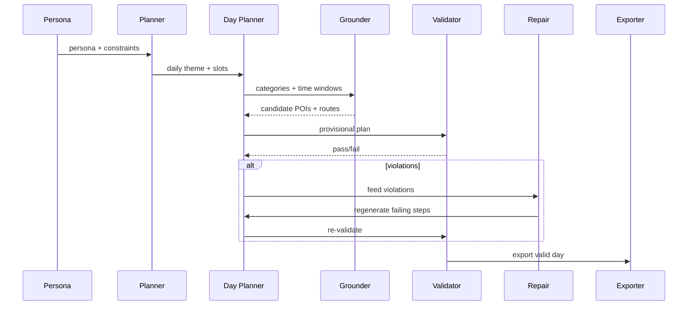

For the Map Challenge, I wanted to test a simple but thorny idea: can a large language model (LLM) generate a realistic week of movement for a made-up person in a city — complete with reasons, places, and feasible routes — without using any real personal data?

This experiment blends three things I care about:

1. Geospatial grounding (real POIs and routes, not hallucinations)

2. Agent design (multi-step planning with validation loops)

3. Interpretability (not just “where” but “why” a persona moves)

It’s also an informal riff on recent academic work (Wang et al. 2024) that treats LLMs as urban residents. Where they start from real check-ins, I start from personas and let the AI improvise.

## The personas 

To gauge how well the LLM can generate realistic mobility patterns, I set up three life stages based on myself:

- 25-year-old: married, living in Stratford, commuting to West Kensington three days a week, playing badminton, exploring food with a partner.
- 24-year-old: postgraduate student in North Finchley, short on time, sticking to uni, libraries, and local parks, mostly walking or biking.
- 17-year-old: student near Warren Street, into music, weekends spent record hunting, library visits, and small gigs.

Each persona feeds into the planner as a JSON profile: home location, commute anchor, interests, and mode preferences.

## How the system works in general 
At a high level: planner → daily planner → grounding → validation → export → visualization. 

```mermaid
flowchart LR
    A[Persona Profile] --> B[Planner Agent\n(weekly plan)]
    B --> C[Day Planner\n(hour-by-hour timeline)]
    C --> D[POI & Route Grounder\nGoogle Places / Directions]
    D --> E[Validator\n(opening hours, time budgets,\ntravel time checks)]
    E -- ok --> F[Trajectory Exporter\nTripLayer JSON]
    E -- violations --> G[Repair Prompt]
    G --> C
    F --> H[Deck.GL UI\nReact TripLayer]
```
Components in practice

1/ Planner Agent sketches the week: themes (work days, leisure days) and rough slots.

2. Day Planner expands each slot into timestamped activities with categories (e.g., “library,” “sports”).

3. Grounder queries Google Places for venues and Directions for realistic routes.

4. Validator checks feasibility (open hours, time budgets, no teleporting). If something fails, a Repair Prompt regenerates only the broken parts.

5. Exporter/UI serializes to TripLayer JSON, which Deck.GL plays back interactively.  




## Trace example 
Here’s a snippet of what a generated trace looks like before it’s rendered:
```json
{
  "trip_layer": {
    "routes": [
      [[-0.18292, 51.61238], [-0.18273, 51.61225], ...],
      [[-0.18292, 51.61238], [-0.18270, 51.61221], ...]
    ]
  }
}
```
Each array is a leg of a day — home → work, work → café, etc. Deck.GL animates these so you can scrub through a persona’s week.

Patterns I noticed:

- Anchors are consistent (the student doesn’t “move house” mid-week).

- Commutes are plausible (e.g., Stratford → West Kensington takes about the right time).

- Activity variety feels human (study, sport, food, social).

Where it drifts:

- Strange detours (tiny zig-zags or implausible mid-work café breaks).

- Venue realism (AI once put me at London Aquatics Centre for badminton… close, but not quite). 

## How this differs from Wang et al. (2024) 
