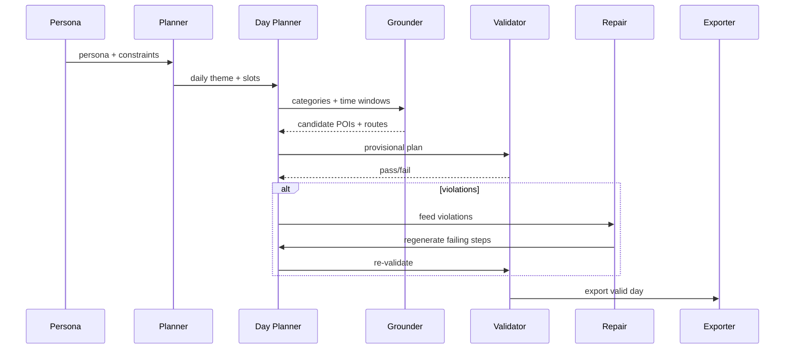

As part of the 2024 30-Day Map Challenge, I set myself a strange experiment: could an AI imagine what it’s like to live a week in London? Not just drawing lines on a map, but actually planning routines the way a person might — commuting, studying, playing sports, and finding time for food and music.

The question sounds whimsical, but it touches something serious: our movement through a city is structured by habits, constraints, and motivations. Traditional mobility models are good at predicting where people go, but not so good at explaining why. Large Language Models (LLMs), with their knack for storytelling and reasoning, seem oddly suited to the task.

## From Personas to Plans 

I started not with real data, but with personas. A 25-year-old commuting from Stratford, newly married and juggling work with badminton and food outings. A 24-year-old postgraduate student in North Finchley, short on time and usually tethered to university and nearby parks. A 17-year-old near Warren Street, in love with records and small gigs, weekends orbiting around London’s indie music scene.

Each persona became a seed: a bit of narrative, a home base, a rough commute pattern, a set of interests. The job of the AI was to turn this into a plausible weekly routine.

I designed a two-level planning system. At the top, a “weekly planner” sketched the rhythm of the week — which days were for work, which for study, which for leisure. At the next level, a “day planner” expanded each slot into concrete activities: leaving home at 8:10, studying in a library until lunchtime, playing badminton in the evening.

Of course, an AI left to itself can get fanciful. To anchor these plans in the real city, I connected the system to Google Places and Directions APIs. When the model proposed “go to a library in Bloomsbury,” the system pulled up actual libraries, checked their opening hours, and calculated realistic routes and travel times.

This grounding step mattered. It meant the AI couldn’t simply teleport from Finchley to a gig in Camden in five minutes. Each leg of the day had to fit into the clock and the map. If something failed — a venue was closed, a trip took too long — the system would push back, asking the model to repair the plan.

The final plans were exported into a format that could be animated on a map. Using Deck.GL, I built an interface where you can watch each persona’s week unfold, day by day, trip by trip.

At a high level, the sequence would be  planner → daily planner → grounding → validation → export → visualization. 

## What Emerged

The results were often startlingly coherent. The 25-year-old’s map filled with Stratford anchors and regular commutes to West Kensington, dotted with food trips on the weekend. The 24-year-old circled between campus, parks, and home, mostly on foot or bike. The 17-year-old gravitated toward record shops and gig venues around central London.

But there were quirks too. The AI occasionally slipped in odd detours — a café visit in the middle of a lecture, or a badminton session at the London Aquatics Centre that doesn’t actually host badminton. These failures were as revealing as the successes: they showed where the model needed firmer constraints or a better sense of routine.

## Standing on Shoulders

Around the same time, Wang et al. (2024) published a paper treating LLMs as “urban residents.” Their approach starts with historical check-in data, extracts activity patterns, and uses the model to generate daily routines grounded in those patterns. They further tested scenarios like pandemic lockdowns, showing how mobility shifts when external constraints are applied.

My project comes from the opposite direction. Instead of data-first, it’s persona-first. Instead of statistical benchmarks, I leaned on qualitative plausibility and interactive exploration.

## Lessons and Next Steps

What I learned is that LLMs are surprisingly good at sequencing — they know how to make a day look like a day. But they only shine when paired with constraints. Real POIs, travel times, and opening hours turn vague storytelling into something you can actually walk on a map.

The failures point to obvious upgrades: adding a memory of the last few days so routines evolve more naturally, filtering POIs by opening hours before the model even sees them, and experimenting with “scenario prompts” (what happens during a Tube strike? or a week of rain?).

For now, the maps are playful artifacts. But I do think it hint at a bigger horizon: using generative systems not just to predict where people go, but to explore how motivations, constraints, and scenarios shape our lives in space.

